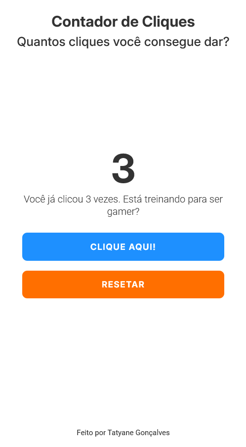
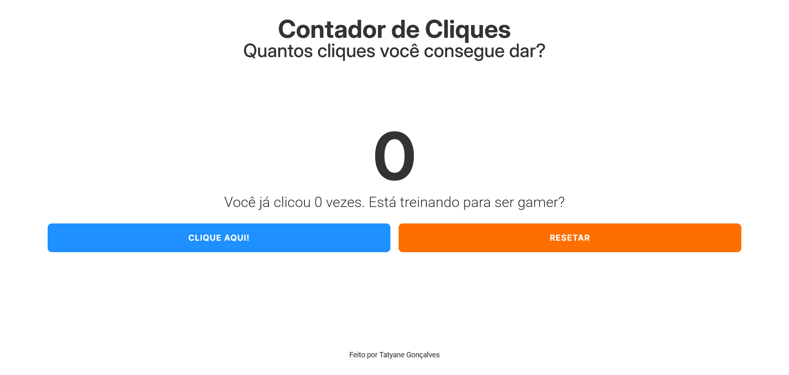

# 🖱️ ClickIt! - Seu contador de cliques personalizado

Aplicação simples em HTML, CSS e JavaScript puro que contabilize os cliques do usuário. Criado para praticar DOM, eventos, manipulação de estado em tempo real no frontend e estilização com um layout responsivo e atrativo .

---

## 🧠 Funcionalidades
- ✅ Um botão que, ao ser clicado, incrementa um contador exibido na tela.
- ✅ Ao atingir 10 cliques, uma mensagem especial aparece.
- ✅ Contador é reiniciado quando a página é recarregada (não salva os dados).
- ✅ Interface simples, centralizada e agradável.
- ✅ Botão de reset do contador
---

## 🧑‍💼 Pedido do cliente

> "Quero um botão que conte cliques. Quando chegar em 10, aparece uma mensagem dizendo que a pessoa chegou lá. Só precisa funcionar enquanto o site estiver aberto."

---

## 📁 Estrutura do Projeto

```bash
click-counter/
├── src /
│   ├── screenshots /
│   │   ├── preview-mobile.png   # Captura de tela da versão celular
│   │   └── preview-desktop.png  # Captura de tela da versão computador
│   ├── scripts/
│   │     └── main.js  # Lógica JavaScript para contador de clique
│   └── styles/
│         └── style.css   # Folha de estilo com layout responsivo
│   
├── index.html               # Arquivo HTML principal
├── README.md                # Documentação do projeto em português - PT/BR (Este arquivo)
└── README.md                # Documentação do projeto em inglês
```

---

## 📸 Preview
🔗 [Link para o projeto em produção ](https://click-counter-eight.vercel.app/)



---

## 🛠️ Tecnologias usadas
- HTML5
- CSS3
- JavaScript Vanilla (puro)

---

## 📂 Como rodar
1. Clone o repositório:

```bash
   git clone https://github.com/tatyanepgoncalves/click-counter.git
```

2. Acesse a pasta do projeto:

```bash
cd click-counter
```

3. Abra o arquivo `index.html` no seu navegador

> Simples assim. Nada de back-end, nada de dependências.

---

## ✨ Funcionalidades Extras (futuras ideias)
- Mostrar data/hora do último clique
- Animação ao clicar no botão

--- 

## 💡 Objetivo
Este projeto é voltado para quem está iniciando com JavaScript e quer praticar a manipulação de eventos e atualização do DOM em tempo real, com um desafio leve e útil.


Feito com 💜 por Tatyane Gonçalves