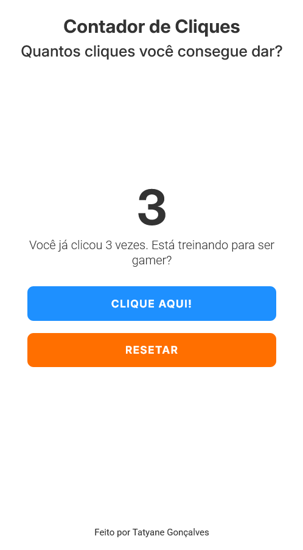

# 🖱️ ClickIt! - Your Personalized Click Counter

Simple aplication built HMTL, CSS, and JavaScript Vanilla that counts user clicks. Created to practice DOM, events handling,time real state update in Frontend, and styling with a responsive layout and attractive layout.

---

## 🧠 Features
- ✅ A button that increments a counter displayed on the screen when clicked.
- ✅ When the counter reaches 10 clicks, a special message appears.
- ✅ The counter resets when the page is reloaded(dta is not saved).
- ✅ Simple, centered, and user-friendly interface.
- ✅ Reset button to reset the counter.

---

## 🧑‍💼  Client Request

> "I want a button that counts clicks. When it reaches 10, a message should appear saying the user made it. It only needs to work while the website is open"

---

## 📁 Project Structure

```bash
click-counter/
├── src /
│   ├── screenshots /
│   │   ├── preview-mobile.png   # Screenshot of the mobile version
│   │   └── preview-desktop.png  # Screenshot of the desktop version
│   ├── scripts/
│   │     └── main.js  # JavaScript logic for the click counter
│   ├── styles /
│   │     └── style.css   # Stylesheet with responsive layout
├── index.html               # Main HTML file              
├── README.md                # Project documentation in Portuguese
└── README.md                # Project documentation in English (this file)
```

---

## 📸 Preview
🔗 [Link para o projeto em produção ](https://click-counter-eight.vercel.app/)



---

## 🛠️ Technologys used
- HTML5
- CSS3
- Vanilla JavaScript  

---

## 📂 How the run
1. Clone the repository:

```bash
   git clone https://github.com/tatyanepgoncalves/click-counter.git
```

2. Navigate into the project folder:

```bash
cd click-counter
```

3. Open the `index.html` file in your browser
Abra o arquivo  no seu navegador

> That's it! No back-end, no dependecies.

---

---

## ✨ Extra Features (future ideas)
- Display the date/time of the last click
- Add click animation to the button

--- 

## 💡 Objective
This project is aimed at beginners learning JavaScript who want to practice event handling and real-time DOM updates, with a simple and useful challenge.


Made with 💜 by Tatyane Gonçalves